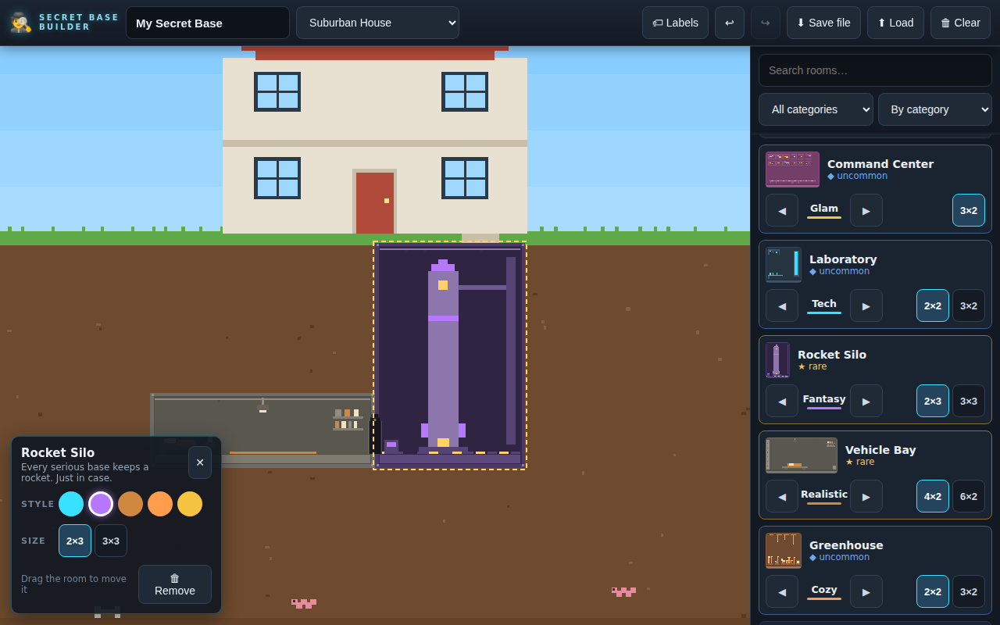
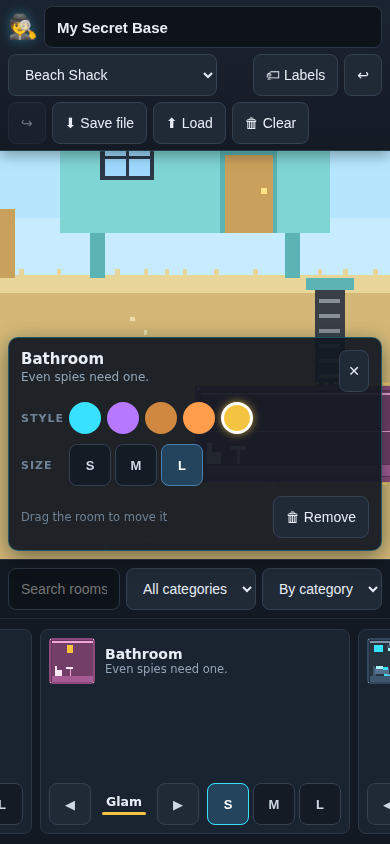

# 🕵️ Secret Base Builder

*Working title: **Me and Sailor Bunker***

A web-based creative sandbox where kids build the ultimate secret base in a
2D side-cutaway view — high-fidelity pixel art, Spy Kids energy, zero
resource constraints. Drag rooms from a giant catalog into the dirt and watch
them snap together into a living hideout.



Rooms placed next to each other automatically connect with doorways and
ladder hatches. 1-tall rooms come in size tiers (S/M/L/XL) with a per-card
style flipper across five themes (tech, fantasy, realistic, cozy, glam) —
style is per-room, so mixing is half the fun. Selecting a room opens an
inspector to restyle, resize, or remove it. Works on phones too (bottom-sheet
catalog, big touch targets):



## Play with it

```bash
npm install
npm run dev
```

Pick an environment (the disguise up top: house, cabin, shack, dome, or
tower — each bundles weather and dirt), then drag rooms from the right-hand
catalog into the underground. Works with mouse and touch.

- **Drag empty space** to pan, **wheel/pinch** to zoom
- **Drag a placed room** to move it, **tap** to select, **Delete** to remove
- **Ctrl+Z / Ctrl+Y** undo/redo, 🏷 **Labels** toggles room-name overlay
- Autosaves in the browser; **Save file / Load** exports and imports `.json`
  bases you can share

## For developers (and AI models)

Start with these, in order:

1. [`docs/design/gdd.json`](docs/design/gdd.json) — machine-readable design
   source of truth
2. [`docs/ARCHITECTURE.md`](docs/ARCHITECTURE.md) — layer contracts
3. [`docs/PLAN.md`](docs/PLAN.md) — live, resumable build plan
4. [`CLAUDE.md`](CLAUDE.md) — hard rules for extending the game

The one-paragraph version: all content (module kinds, themes, environments)
is data in `src/content/*.json`, validated by `npm run validate:content`.
All art is addressed by sprite key (`kind_WxH_theme`); until final art
lands, a deterministic procedural generator draws pixel-art placeholders,
and dropping a real PNG into `public/art/modules/` (listed in
`public/art/art-manifest.json`) overrides it with zero code changes. Core
logic (`src/core/`) is DOM-free and tested (`npm test`).

```bash
npm test                  # core logic tests
npm run validate:content  # content manifest checks
npm run build             # typecheck + production build
```
